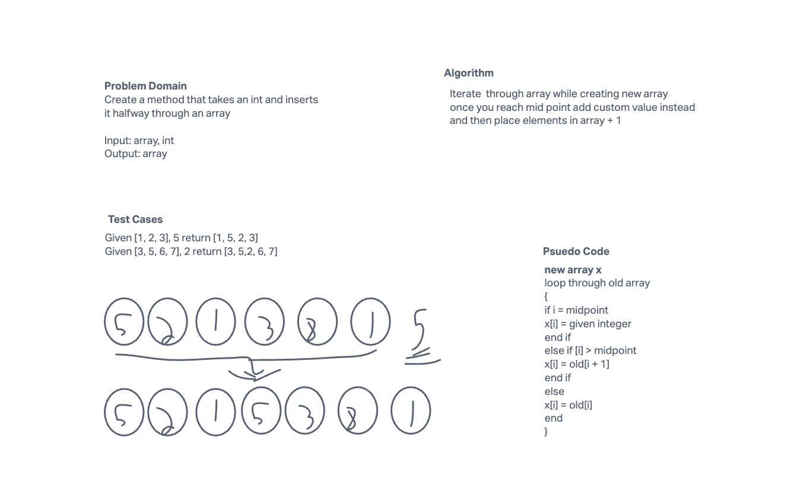

# Array Insert Shift

Insert a given int into the midpoint of an array without using any array methods

## Whiteboard Proccess



## Approach & Efficiency

Loop through array while creating new array and upon reaching midpoint insert new value then continue

```java
int midPoint = (int) (arr.length / 2);

    int[] newArr = new int[arr.length + 1];
    for (int i = 0; i < arr.length + 1; ++i)
      {
        if (i == midPoint)
        {
          newArr[i] = value;
        }
        else if (i > midPoint)
        {
          newArr[i] = arr[i - 1];
        }
        else
        {
          newArr[i] = arr[i];
        }
      }

    return newArr;
```
