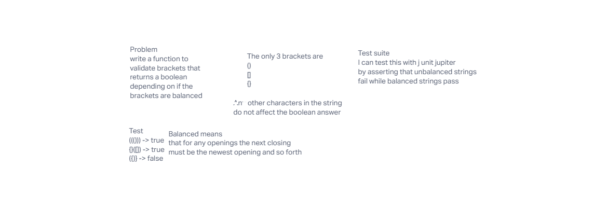

# Animal Shelter

## Whiteboard

## Solution

Use one stack to hold all opening tags and make sure the current closing tag equals the top of the stack

Stack: {{(([[
Character = ]
In this situation the top of the stack equals the current closing tag so the code would move on
