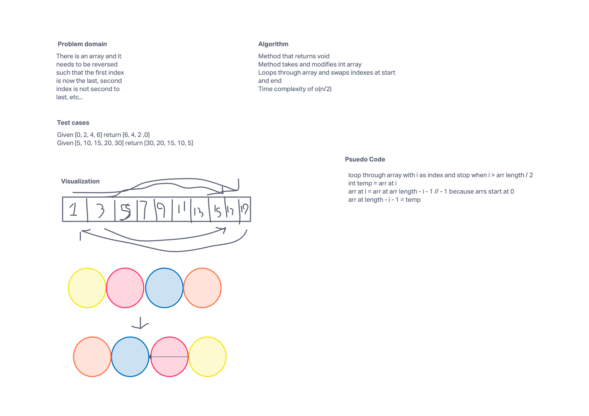

# Reverse an array

In this challenge you must take an array and reverse all of it
Example: [5, 3, 1, 2] will be turned into [2, 1, 3, 5]

## Whiteboard Proccess



## Approach & Efficiency

My approach to this was to swap the indexes at the start and end of the array until they meet in the middle and the time complexity is o(n/2)

```java
for (int i = 0; i < arr.length / 2; ++i)
      {
        int temp = arr[i]; //5
        arr[i] = arr[arr.length - i - 1];
        arr[arr.length - i - 1] = temp;
      }
```
