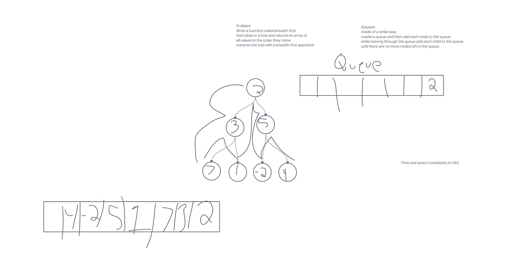

# Tree

## Tree-max

### White Board

.png)

### Solution

Traverse the binary tree in any way (I will use pre-order) and as you traverse the binary tree store the max value as an int

## Breadth First

### White Board

### Solution

Inside of a while loop create a queue and then add each node to the queue while moving through the queue add each child to the queue until there are no more nodes left in the queue
